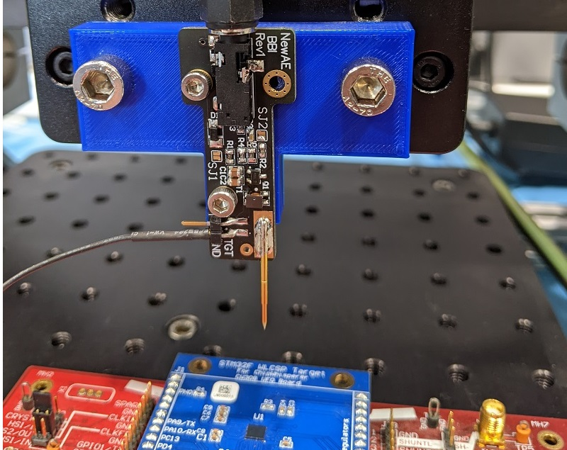

# ChipJabber-BasicBBI

What the heck is Body Biasing Injection? This is a method of injecting faults into the backside of an IC, which results in an injection somewhere between EMFI & Laser-FI. This work has been presented since 2012, yet there has been less follow on work compared to topics such as EMFI & Laser FI. ChipJabber-BasicBBI tries to help with that by making available both the injection tool & target for all!



You can see the following papers for the origins of this:

* Philippe Maurine. **Techniques for EM Fault Injection: Equipments and Experimental Results**. FDTC 2012: Workshop on Fault Diagnosis and Tolerance in Cryptography. 9 Sept. 2012. [PDF Available](https://hal-lirmm.ccsd.cnrs.fr/lirmm-00761778/document).

* Philippe Maurine, Karim Tobich, Thomas Ordas, Pierre Yvan Liardet. **Yet Another Fault Injection Technique: by Forward Body Biasing Injection**. YACC’2012: Yet Another Conference on Cryptography, Sep 2012, Porquerolles Island, France.  [PDF Available](https://hal-lirmm.ccsd.cnrs.fr/lirmm-00762035/document).

* Karim Tobich, Philippe Maurine, Pierre Yvan Liardet, Mathieu Lisart, Thomas Ordas. **Voltage Spikes on the Substrate to Obtain Timing Faults**. 2013 Euromicro Conference on Digital System Design, Los Alamitos, CA, 2013, pp. 483-486. [PDF Available](https://www.researchgate.net/profile/Philippe_Maurine/publication/262352179_Voltage_Spikes_on_the_Substrate_to_Obtain_Timing_Faults/links/54b805100cf2c27adc487b12/Voltage-Spikes-on-the-Substrate-to-Obtain-Timing-Faults.pdf)

* Noemie Beringuier-Boher, Marc Lacruche, David El-Baze, Jean-Max Dutertre, Jean-Baptiste Rigaud, Philippe Maurine. **Body Biasing Injection Attacks in Practice**. In Proceedings of the Third Workshop on Cryptography and Security in Computing Systems (CS2 '16), 2016. [PDF Available](https://dl.acm.org/doi/pdf/10.1145/2858930.2858940)


## BBI Made Simple

BBI uses a simple idea - use a physical probe on the IC die *backside*. While it turns out that WLCSP devices expose the backside (or have some flimsy film over it you can remove easily), allowing you to perform BBI without becoming [John McMaster](https://twitter.com/johndmcmaster).

The idea of this repo is to perform BBI using a simple probe, which uses a transformer to generate the required pulses. This looks something like this:


## CARDIS 2020 Paper

This work was presented at CARDIS 2020, see an extended version of the paper in the [CARDIS](cardis2020/ChipJabber_BBI.pdf) directory of this repository. If you use these results (or this design), please reference:

```
O'Flynn, Colin. (2021) Low-Cost Body Biasing Injection (BBI) Attacks on WLCSP Devices.
In: Liardet PY., Mentens N. (eds) Smart Card Research and Advanced Applications. CARDIS 2020.
Lecture Notes in Computer Science, vol 12609. Springer, Cham. https://doi.org/10.1007/978-3-030-68487-7_11
```

You can pull the citation from the [SpringerLink page](https://link.springer.com/chapter/10.1007/978-3-030-68487-7_11#citeas) as well.