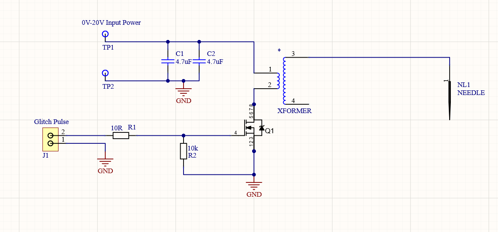
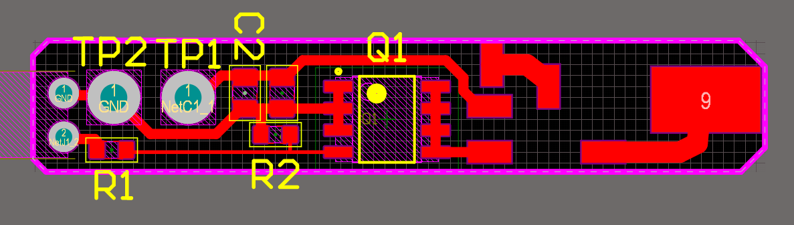

# ChipJabber-BasicBBI Rev0

This revision of the BBI probe matches the one in Colin's CARDIS 2020 paper. It was originally designed to be made on a Bantam PCB mill, so is extremely bare-bones.

## Construction Instructions

### PCB Details

The PCB was built with parts on hand, so it is very bare-bones. You might want to see Rev1 edition for a better design.

The following shows the schematic:

And the base PCB:

Gerber files are in the relevant directory, they should be loadable in the Bantam PCB milling software. If you are going to the effort of ordering PCBs, suggest to use the V1 edition instead which more effort was put into.

### Custom Coil Winding

The "heart" of BasicBBI is a custom wound coil. This coil is surprisingly uncritical how you wind it, but you've got to do it. The suggested coil is based on these parts:

* Fair-Rite rod [3061990871](https://www.digikey.ca/en/products/detail/fair-rite-products-corp/3061990871/8599472)
* 26 AWG, and 30 AWG magnetic wire, available in [Sparkfun PRT-11363](https://www.digikey.ca/en/products/detail/sparkfun-electronics/PRT-11363/5230957)

Optionally, you may find some Super-Glue + Accelerator/Activator convenient to freeze your windings in place. 

To wind the coil:

1. Wind 6 turns of 26 AWG magnet wire, this is the primary.
2. Use some glue (the super-glue + accelerator is easiest here) to hold the winding in place.
3. Wind 60 turns of the 30 AWG magnet wire on-top. You'll have to go back and forth several times. It can be fairly messy and still seems to work fine.

Leave lots of spare wire, as you can tin the wires once you see how it fits onto the PCB. See details below.

### PCB Assembly

In addition to the coil, you will need a pogo pin. Harwin P25-0123 is available on Digikey & Mouser, otherwise you can find similar ones on various cheaper sites if you wish.

## Usage Instructions

To use this probe:

1. Connect a pulse generator to the MOSFET gate. In the COSADE BBI work, the ChipWhisperer-Lite is used. The signal routed to the on-board mosfet is tapped off at JP8, the center pin as the "glitch_lp" mosfet drive signal.

2. Connect a power source that has a 100~mA current limit to the probe. If you don't have a current limited supply, use a ~100 ohm resistor inline. The probe discharges from the capacitors on-board anyway. **WARNING: Using a non-current-limited supply it becomes likely you accidentally turn on the MOSFET for too long, which will have a direct short across the supply rails.**

3. Place the bbi probe over your WLCSP device. If you aren't sure if the package exposes the die backside, use a DMM to check for a 20K-400K resistance between the die backside and VCC or GND.
