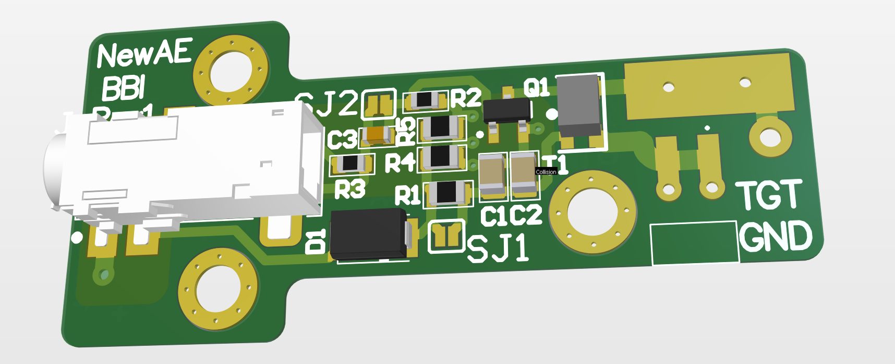
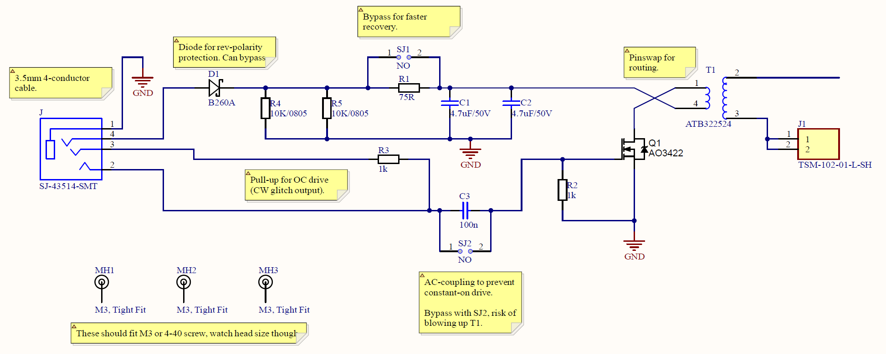

# BasicBBI-Rev1

The BasicBBI Rev1 allows assembly with off-the-shelf parts, while adding some critical features such as mounting holes and protection from easily destroying the probe. The current test board ('PCB Rev A') looks like this:



**Be aware this is untested.** A version of this PCB has been validated, but this exact one isn't yet.

## Usage

See the CARDIS 2020 paper for general information on the design & usage of this device. You'll need a 3.5mm, 4-conductor "tip ring ring sleeve" cable. You can use any generic off-the-shelf cable, or for example you can even buy from Digi-Key cables such as 839-1600-ND which saves you needing to cut a cable in half!

```
 +------------ Pulse input (logic level drive, AC-coupled)
 |  +--------- Optional pull-up
 |  |
<[] [] [] []|======
       |  |
       |  +--- GND
       +------ Voltage In (range, 0 to 30V. Use small current limit such as 50mA)
```

To prevent you from blowing up the transformer T1 or MOSFET Q1, the input pulse drive is AC-coupled. You can remove this coupling by shorting `J2`.

When using the probe in AC-coupled mode (the default), you can also take advantage of the AC-coupling to allow usage from the ChipWhisperer "glitch output" (which is effectively an *open-collector* drive). To do this:

* Connect the pull-up to a 3.3V supply.
* Use the ChipWhisperer to pull down the pulse input to generate pulses. This works due to the AC-coupling of the input signal.


## Parts

The following are the 'specific' parts used in the design (format is `QTY, PART NUMBER, DESIGNATOR`).

```
1,B260A,D1
1,AO3422,Q1
1,ATB322524,T1
1,TSM-102-01-L-SH,J1
```

If you need to sub `D1` or `Q1`:

* D1 is for reverse polarity protection so can be skipped. If you can't find that part use the following:
	* DO-214AC (SMA) package
	* Schottky
	* 500mA or higher current rating
	* 40V or higher voltage rating
* Q1 is a logic-level MOSFET in SOT23 package. If you need a replacement use the following criteria:
	* N-Channel
	* Check pinout matches expected
	* Logic level drive (spec of something like 2.5V 'Max Rds On', 4.5V 'Min Rds On')
	* 1.8A or higher (only for pulse current reasons - can get away with smaller one)
	* 50V or higher Drain to Source Voltage (Vdss) 
 
`J1` can be sub'd with any header that you can solder, or even just wire.

The other parts are very generic:

```
1, 100n 0603 [Generic]
2, 4.7uF 0805 50V or 63V [Generic]
1, 10K 0805 5% or 1% [Generic]
2, 1K 0603 5% or 1% [Generic]
```

## Schematic

