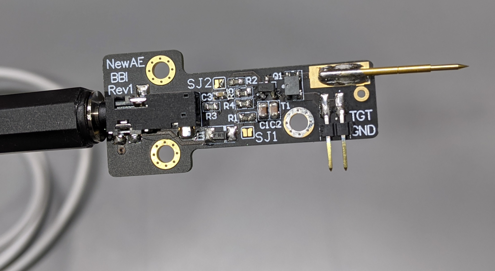

# BasicBBI-Rev1

The BasicBBI Rev1 allows assembly with off-the-shelf parts, while adding some critical features such as mounting holes and protection from easily destroying the probe. The current test board ('PCB Rev A') looks like this:



It requires a 3.3V logic-level waveform from the ChipWhisperer board (or any other signal source).

## Usage

See the CARDIS 2020 paper for general information on the design & usage of this device. You'll need a 3.5mm, 4-conductor "tip ring ring sleeve" cable. You can use any generic off-the-shelf cable, or for example you can even buy from Digi-Key cables such as 839-1600-ND which saves you needing to cut a cable in half!

```
 +------------ Pulse input (logic level drive, AC-coupled)
 |  +--------- Optional pull-up or termination.
 |  |
<[] [] [] []|======
       |  |
       |  +--- GND
       +------ Voltage In (range, 0 to 30V. Use small current limit such as 50mA)
```

To prevent you from blowing up the transformer T1 or MOSFET Q1, the input pulse drive is AC-coupled. You can remove this coupling by shorting `J2`.

The "optional pull-up" was originally designed to allow driving the BBI probe directly from a ChipWhisperer "glitch" output - this does't work well in practice, as you need a very long "glitch width" in order to get a positive
spike on the MOSFET gate (and not the negative spike you'll see with narrow pulses). If driving from ChipWhisperer-Lite use the logic-level glitch output available either on HS2 or with the 

**NOTE:** If you use the logic-level ChipWhisperer outputs (such as the HS2 line), you don't need to do this pull-up hack. The ChipWhisperer logic-level outputs can directly be connected to the `pulse input`.


## Parts

The following are the 'specific' parts used in the design (format is `QTY, PART NUMBER, DESIGNATOR`).

```
1,B260A,D1
1,AO3422,Q1
1,ATB322524,T1
1,TSM-102-01-L-SH,J1
1,P25-0123,PROBE
```

If you need to sub `D1` or `Q1`:

* D1 is for reverse polarity protection so can be skipped. If you can't find that part use the following:
	* DO-214AC (SMA) package
	* Schottky
	* 500mA or higher current rating
	* 40V or higher voltage rating
* Q1 is a logic-level MOSFET in SOT23 package. If you need a replacement use the following criteria:
	* N-Channel
	* Check pinout matches expected
	* Logic level drive (spec of something like 2.5V 'Max Rds On', 4.5V 'Min Rds On')
	* 1.8A or higher (only for pulse current reasons - can get away with smaller one)
	* 45V or higher Drain to Source Voltage (Vdss) 
 
`J1` can be sub'd with any header that you can solder, or even just wire.

`PROBE` is a sharp pogo pin. The Harwin `P25-0123` is a good low-cost option, you can get fancier (smaller point) probes too.

The other parts are very generic, I didn't have part numbers for them:

```
1, 100n 0603 [Generic]
2, 4.7uF 0805 50V or 63V [Generic]
1, 10K 0805 5% or 1% [Generic]
2, 1K 0603 5% or 1% [Generic]
```

## Schematic

A PDF of the schematic is in the repo, here is a image for convenience:


## PCB

PCB gerbers are in the repo.

One version of the gerbers has been generated with the Bantam Mill output standard. The vias around the mounting holes have also been removed in this version (since they would probably damage your bit and do nothing with a milled PCB).