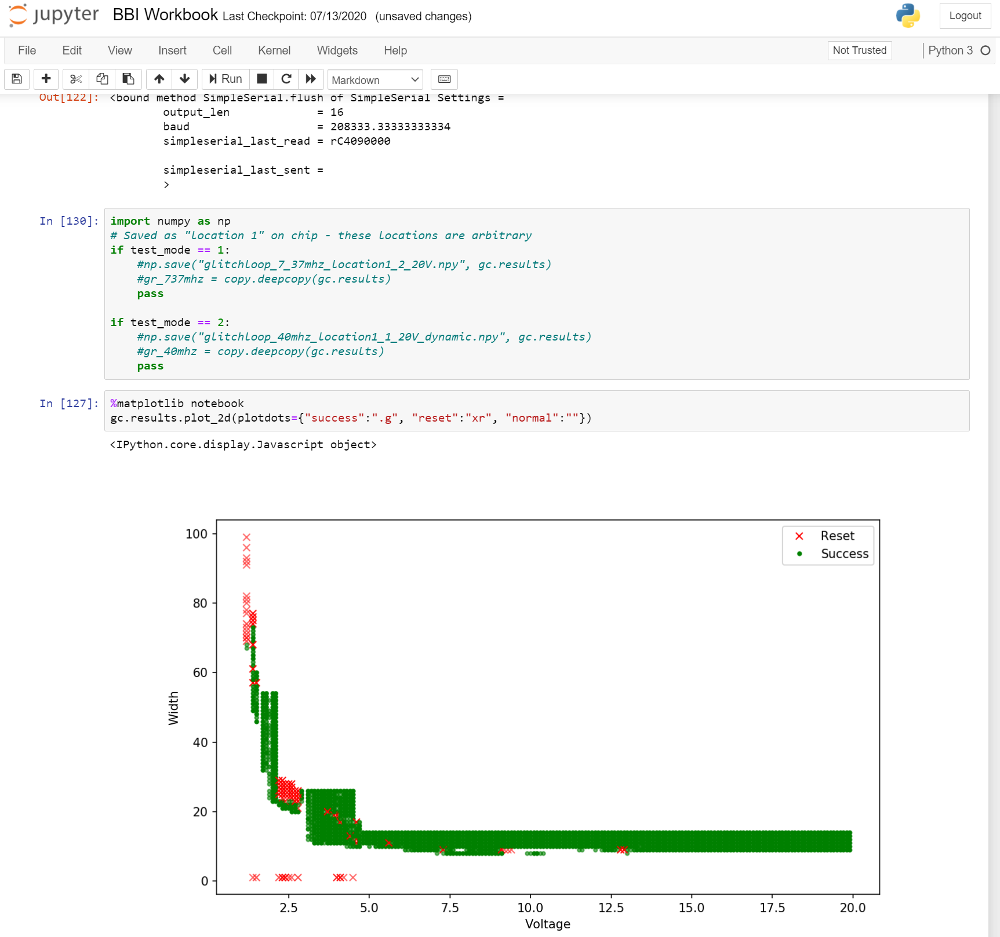
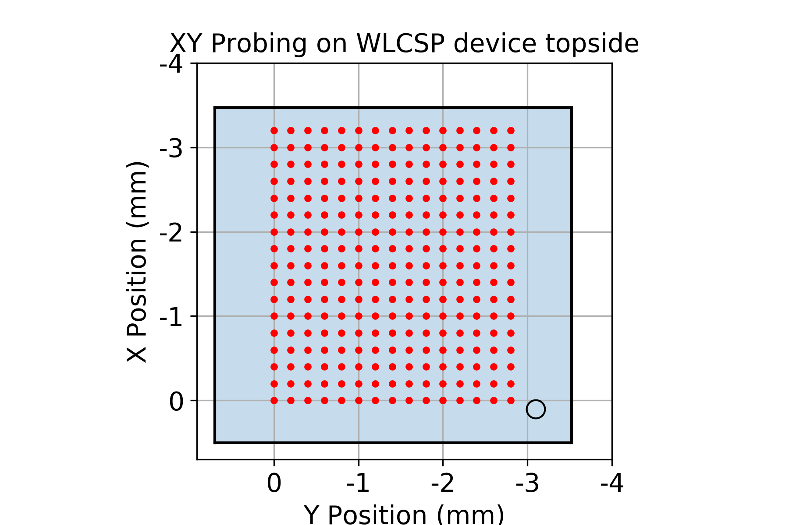
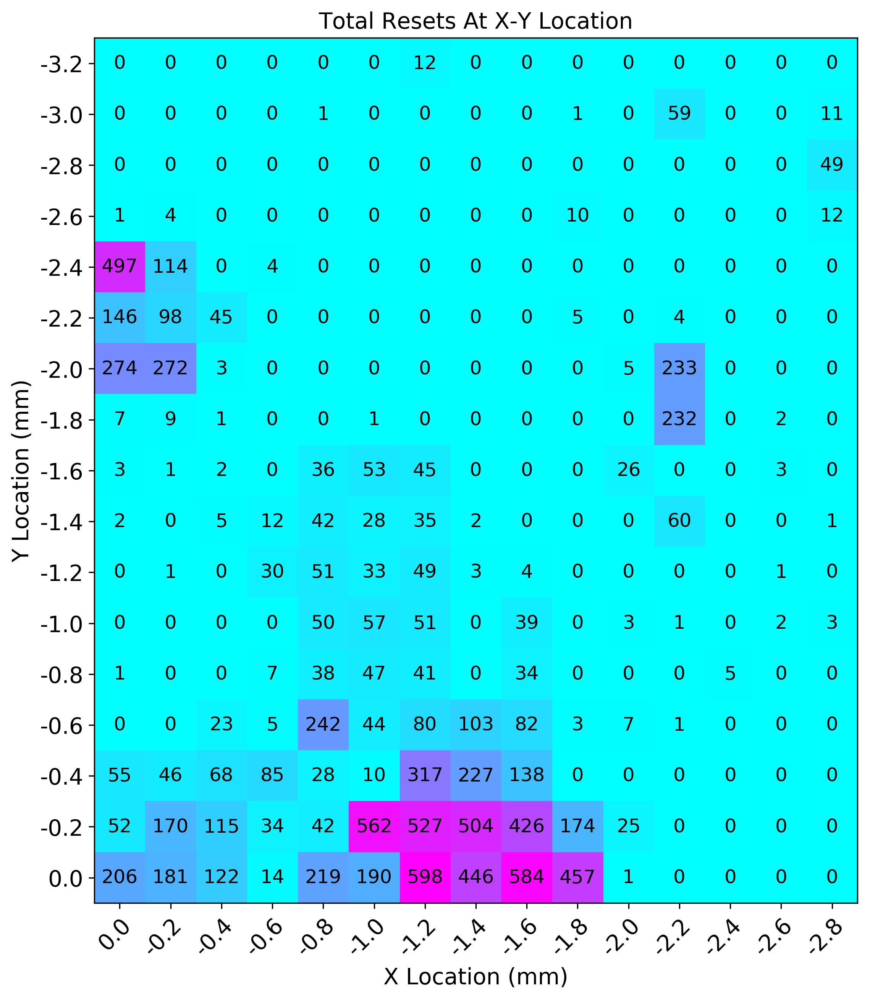
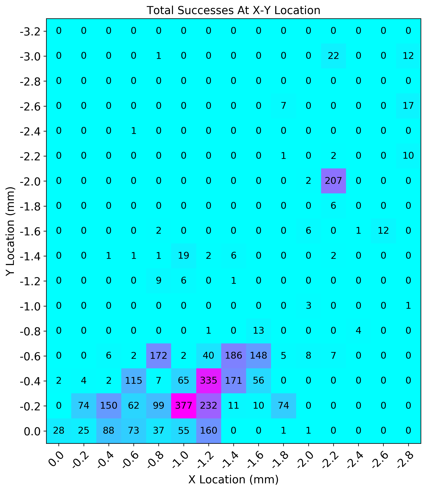
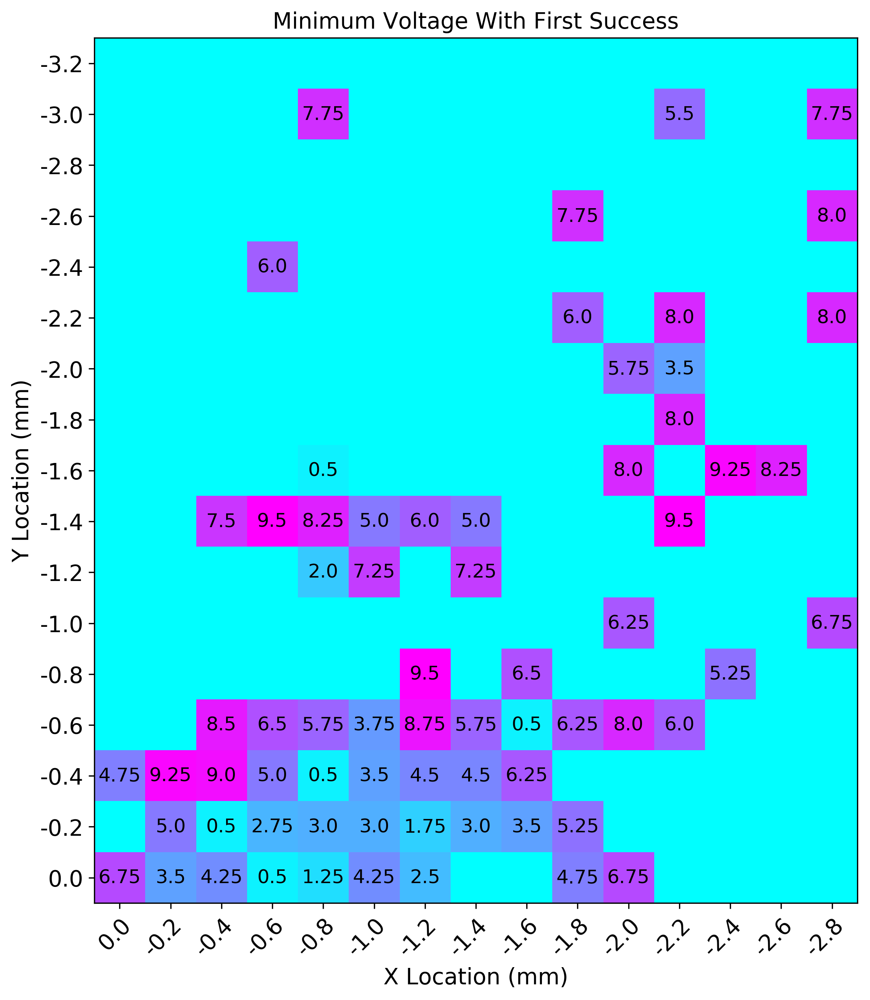
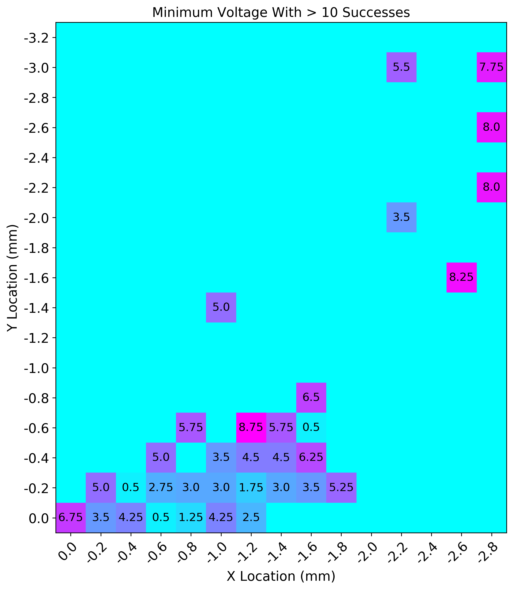

# Jupyter Notebooks

This repo contains the notebooks used for data capture, along with generating figures used in Colin's
paper in CARDIS2020. You can see an example of the Jupyter notebook here:

## XY Scanner Results

Using a ChipShover controller, we scan part of the WLCSP package. The area scanned is shown below:

We can see the number of successes and rests at locations:

We can also see the voltage setting required to get at least one successful glitch:

Or at least 10 successful glitches:

A notebook allows you to recreate these figures, but also contain the raw data captures. You can use this to plot other information.